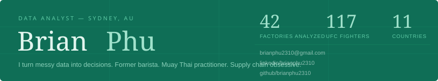
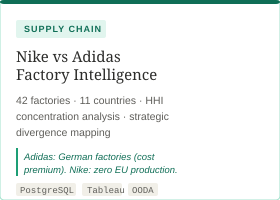
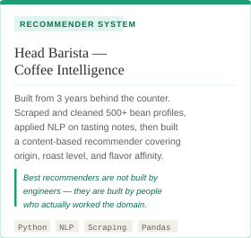
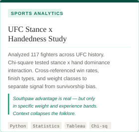
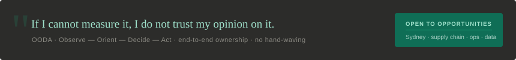

  

 

---

### About

I work end-to-end — from scraping raw data to shipping something people can actually use. My framework is OODA: Observe, Orient, Decide, Act. I picked it up not from a textbook but from years of reading a room full of customers fast. Coffee taught me that slow thinking is a luxury most real problems can't afford.

Three things outside work that shaped how I analyze: making espresso (intuition is not a substitute for measurement), training Muay Thai (patterns matter, but so does the one time the pattern breaks), and supply chain nerdery (risk is always more concentrated than it looks on a map).

---

### Projects

  &nbsp;&nbsp;

---

### Stack

  

---

### Approach

  

---

  <a href="mailto:brianphu2310@gmail.com">brianphu2310@gmail.com</a> &nbsp;·&nbsp;
  <a href="https://linkedin.com/in/brianphu2310">LinkedIn</a> &nbsp;·&nbsp;
  <a href="https://github.com/brianphu2310">GitHub</a>

