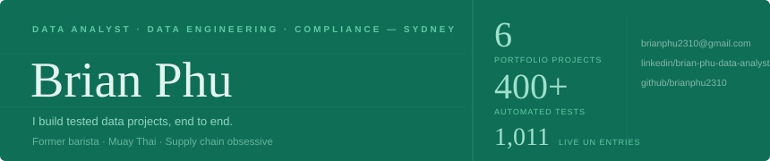
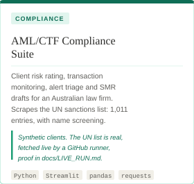
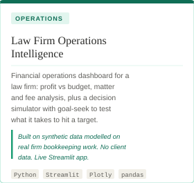
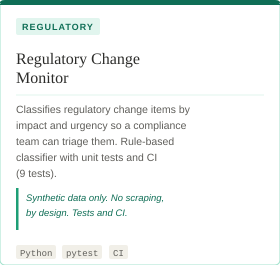
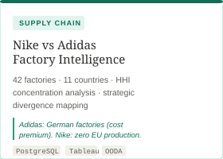
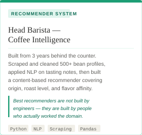
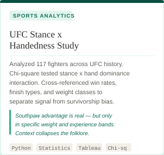
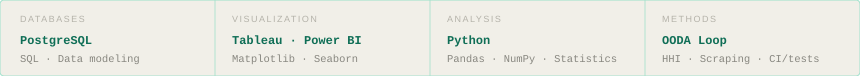
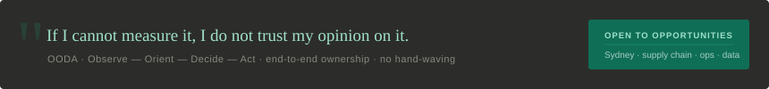

  

 

---

### About

Legal bookkeeper and data migration assistant at a Sydney law firm, finishing a Bachelor of IT, and building a portfolio for **Data Analyst, Data Engineer and AML/compliance analyst** roles. I work end to end: collect and clean the data, model it, test it, and present it so a manager with no technical background can act on it. Framework: OODA (Observe, Orient, Decide, Act), picked up from years of reading a room full of customers as a barista.

Outside work: espresso, Muay Thai and supply chain nerdery.

---

### Projects

  &nbsp;&nbsp;

  &nbsp;&nbsp;

| Project | What it shows | Stack | Proof |
|---|---|---|---|
| [AML/CTF Compliance Suite](https://github.com/brianphu2310/AML-CTF_Analyst) · [live app](https://aml-ctfanalyst-ewy8ksvvc2qzujnxkcradq.streamlit.app) | Client risk rating, transaction monitoring, alert triage, SMR drafts for an Australian law firm (AUSTRAC). Scrapes the UN Security Council sanctions list and screens names against it | Python, Streamlit, Plotly, pandas, requests | [Live run: 1,011 UN entries](https://github.com/brianphu2310/AML-CTF_Analyst/blob/main/docs/LIVE_RUN.md) · 206 tests · CI |
| [Law Firm Operations Intelligence](https://github.com/brianphu2310/Law_Firm_Operations_Intelliigence) · [live app](https://lawfirmoperationsintelliigence-gkymdplvqo2g3smdqcgyxv.streamlit.app) | Financial operations dashboard with a decision simulator (profit vs budget, goal-seek) | Python, Streamlit, Plotly, pandas | Live app · CI |
| [Regulatory Change Monitor](https://github.com/brianphu2310/Regulartory_Change_Monitor) | Rule-based classification of regulatory changes by impact and urgency, for compliance triage | Python, pytest, GitHub Actions | 9 tests · CI · synthetic data, no scraping |
| [Nike vs Adidas Supply Chain](https://github.com/brianphu2310/NIKE-AND-ADIDAS-SUPPLY-CHAIN) | Factory-level competitive analysis, 42 factories in 11 countries, HHI concentration | PostgreSQL, Tableau, Power BI | Tableau + Power BI dashboards · 38 tests · CI |
| [Head Barista Coffee Intelligence](https://github.com/brianphu2310/HEAD-BARISTA-COFFEE-INTELLIGENCE) | Brewing-method data project and bean consultant app | Python, SQL, Streamlit, Tableau, Power BI | [Live scrape run](https://github.com/brianphu2310/HEAD-BARISTA-COFFEE-INTELLIGENCE/blob/main/docs/LIVE_RUN.md) · 59 tests · CI |
| [UFC Stance & Handedness](https://github.com/brianphu2310/UFC_STANCE_AND_HANDEDNESS_INTELLIGENCE) | Scraper design, cleaning, hypothesis tests and a KNN fighter recommender | Python, SciPy, Streamlit, Tableau, Power BI | [Run log](https://github.com/brianphu2310/UFC_STANCE_AND_HANDEDNESS_INTELLIGENCE/blob/main/docs/LIVE_RUN.md) · 96 tests · CI |

**How to check my claims:** each repo has `docs/LIVE_RUN.md`, written by a GitHub Actions run, not by hand. Where a source blocked automated access (UFCStats, Perfect Daily Grind), the log shows 0 rows and I did not bypass the block. Data in the compliance and law-firm projects is synthetic, and the repos say so.

---

### Proof, not claims

| Project | CI | What it found or proves |
|---|---|---|
| [AML/CTF Compliance Suite](https://github.com/brianphu2310/AML-CTF_Analyst) |  | 1,011 UN sanctions entries fetched live in CI and screened by name; 206 tests · [run log](https://github.com/brianphu2310/AML-CTF_Analyst/blob/main/docs/LIVE_RUN.md) |
| [Law Firm Operations Intelligence](https://github.com/brianphu2310/Law_Firm_Operations_Intelliigence) |  | Profit vs budget with a decision simulator and goal-seek (synthetic data) |
| [Regulatory Change Monitor](https://github.com/brianphu2310/Regulartory_Change_Monitor) |  | 200 synthetic changes: 69 high impact, 54 open actions, 16 overdue; 9 tests |
| [Nike vs Adidas Supply Chain](https://github.com/brianphu2310/NIKE-AND-ADIDAS-SUPPLY-CHAIN) |  | 42 factories in 11 countries, HHI concentration risk; 38 tests |
| [Head Barista Coffee Intelligence](https://github.com/brianphu2310/HEAD-BARISTA-COFFEE-INTELLIGENCE) |  | Live scrape of public sources (Wikipedia 13 rows, Healthline 3); one blocked source logged, not bypassed; 59 tests · [run log](https://github.com/brianphu2310/HEAD-BARISTA-COFFEE-INTELLIGENCE/blob/main/docs/LIVE_RUN.md) |
| [UFC Stance & Handedness](https://github.com/brianphu2310/UFC_STANCE_AND_HANDEDNESS_INTELLIGENCE) |  | 23 of 117 fighters are right-handed southpaws; mean win rate 74.3% vs 70.2% for orthodox + right-handed; 96 tests · [run log](https://github.com/brianphu2310/UFC_STANCE_AND_HANDEDNESS_INTELLIGENCE/blob/main/docs/LIVE_RUN.md) |

*The CI badges are live from GitHub Actions. Data in the compliance, law-firm and regulatory projects is synthetic and labelled so; where a source blocked automated access (UFCStats, Perfect Daily Grind) the log shows 0 rows and I did not bypass it.*

---

### Screenshots

<table>
<tr><td align="center" width="33%"> <b><a href="https://github.com/brianphu2310/AML-CTF_Analyst">AML/CTF Compliance Suite</a></b> Streamlit</td><td align="center" width="33%"> <b><a href="https://github.com/brianphu2310/Law_Firm_Operations_Intelliigence">Law Firm Operations Intelligence</a></b> Streamlit</td><td align="center" width="33%"> <b><a href="https://github.com/brianphu2310/Regulartory_Change_Monitor">Regulatory Change Monitor</a></b> Power BI</td></tr><tr><td align="center" width="33%"> <b><a href="https://github.com/brianphu2310/NIKE-AND-ADIDAS-SUPPLY-CHAIN">Nike vs Adidas Supply Chain</a></b> Power BI + Tableau</td><td align="center" width="33%"> <b><a href="https://github.com/brianphu2310/HEAD-BARISTA-COFFEE-INTELLIGENCE">Head Barista Coffee Intelligence</a></b> Power BI + Tableau</td><td align="center" width="33%"> <b><a href="https://github.com/brianphu2310/UFC_STANCE_AND_HANDEDNESS_INTELLIGENCE">UFC Stance & Handedness</a></b> Power BI + Tableau</td></tr>
</table>

One screenshot per project; more pages and the Tableau versions are in each repo. Data in the compliance, law-firm and regulatory projects is synthetic. Portfolio site: <a href="https://delicate-manatee-7e78ab.netlify.app">delicate-manatee-7e78ab.netlify.app</a>

---

### Stack

  

---

### Approach

  

---

  <a href="mailto:brianphu2310@gmail.com">brianphu2310@gmail.com</a> &nbsp;·&nbsp;
  <a href="https://www.linkedin.com/in/brian-phu-data-analysta55353390/">LinkedIn</a> &nbsp;·&nbsp;
  <a href="https://github.com/brianphu2310">GitHub</a> &nbsp;·&nbsp;
  <a href="https://delicate-manatee-7e78ab.netlify.app">Portfolio Web</a>
  
  

