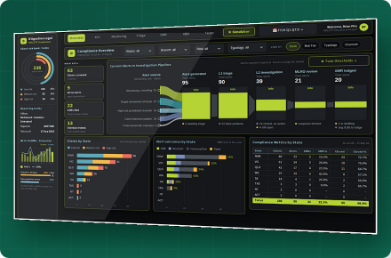
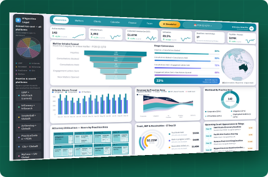
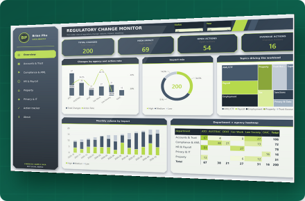
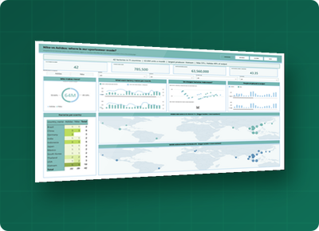
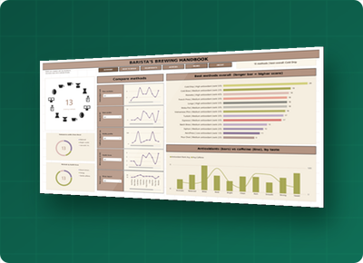
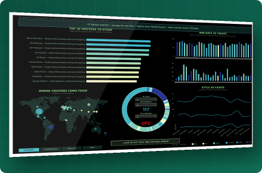

  

Legal accounts professional (law firm finance) and Bachelor of IT (Data Analytics) student, building tested data projects for <b>Data Analyst, Data Engineer and AML/compliance</b> roles. 
SQL · Python · Power BI · Tableau · Streamlit · pytest · GitHub Actions

<table>
<tr><td align="center" width="33%"> <b><a href="https://github.com/brianphu2310/AML-CTF_Analyst">AML/CTF Compliance Suite</a></b> Client risk, alerts, SMRs, live UN sanctions screening 1,011 UN entries fetched in CI · 206 tests </td><td align="center" width="33%"> <b><a href="https://github.com/brianphu2310/Law_Firm_Operations_Intelliigence">Law Firm Operations</a></b> Profit vs budget with a decision simulator Synthetic data · live app </td><td align="center" width="33%"> <b><a href="https://github.com/brianphu2310/Regulartory_Change_Monitor">Regulatory Change Monitor</a></b> Which regulatory changes matter, who must act 200 synthetic items · 9 tests </td></tr><tr><td align="center" width="33%"> <b><a href="https://github.com/brianphu2310/NIKE-AND-ADIDAS-SUPPLY-CHAIN">Nike vs Adidas</a></b> 42 factories, 11 countries, concentration risk Tableau + Power BI · 38 tests </td><td align="center" width="33%"> <b><a href="https://github.com/brianphu2310/HEAD-BARISTA-COFFEE-INTELLIGENCE">Head Barista Coffee</a></b> Brewing methods and a bean recommender Live scrape log · 59 tests </td><td align="center" width="33%"> <b><a href="https://github.com/brianphu2310/UFC_STANCE_AND_HANDEDNESS_INTELLIGENCE">UFC Stance & Handedness</a></b> Does stance change outcomes? Tests + recommender p = 0.07, small effect · 96 tests </td></tr>
</table>

Each repo has tests, CI and an "At a glance" summary with honest limits. Scraper proof is in <code>docs/LIVE_RUN.md</code>; sources that blocked bots (UFCStats, Perfect Daily Grind) are logged as 0 rows, not bypassed. Compliance, law-firm and regulatory data is synthetic.

  <a href="mailto:brianphu2310@gmail.com">Email</a> &nbsp;·&nbsp;
  <a href="https://www.linkedin.com/in/brian-phu-data-analysta55353390/">LinkedIn</a> &nbsp;·&nbsp;
  <a href="https://delicate-manatee-7e78ab.netlify.app">Portfolio web</a>

